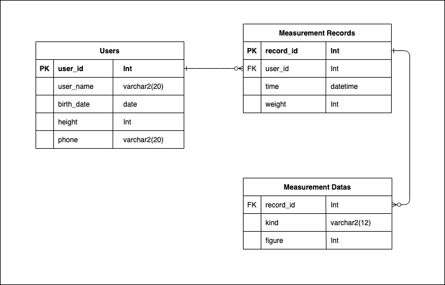

# bodit-task

### TASK1. Data Pipeline 설계

---

### TASK3. DB Table 설계 & Query 작성

1. Create Schema
> `createSchema.sql` 파일 실행

2. Create Table
> `createTable.sql` 파일 실행

3. Create Procedure
> `createProcedure.sql` 파일 실행
> _측정 데이터 입력, 삭제는 프로시저를 통해 실행_

4. Insert Data
- 회원 
    - Insert
        - INSERT INTO `bodit-task`.`users` (`user_name`, `birth_date`, `height`, `phone`) VALUES ('정안나', '2004-02-11', '173', '01049244996');
    - Delete
        - DELETE FROM `bodit-task`.`users` WHERE (`user_id` = '1');
- 측정 기록 
    - Insert
        - INSERT INTO `bodit-task`.`measurement_records` (`user_id`, `time`,, `weight`) VALUES ('1', '2022-10-16 03:38:00', '60');
    - Delete
        - DELETE FROM `bodit-task`.`measurement_records` WHERE (`record_id` = '1');
- 측정 데이터
    - Insert
        CALL insertData(1, "어깨 신전", -30);
    - Delette
        CALL deleteData(1, "어깨 신전");

5. Insert Data State Table
> insertDataState.sql 실행
> _측정 데이터 테이블에 Insert 시 반환될 상태 코드, 종류, 메세지 정보가 저장된 Table_

6. 어꺠 신전, 어깨 굴곡 Insert 제약 조건
> 이 부분은 DBMS가 아닌 Code로 관리해야합니다.

---

### TASK3. API 서버 구현 (1)

#### - 실행 명령어
> npm start

#### - API 명세서
> [bodit-task3-api Post Man Link](https://documenter.getpostman.com/view/16132924/2s8479ybd7)

---

### TASK4. API 서버 구현 (2)

#### - 실행 명령어
> npm start

#### - 실행 조건
> .env file을 만들어 Naver Open API App의 Clent ID와 Client Secret값을 환경변수로 설정

#### - API 명세서
> [bodit-task4-api Post Man Link](https://documenter.getpostman.com/view/16132924/2s847BSEpp)